

# SE-Assignment-6
 Assignment: Introduction to Python
Instructions:
Answer the following questions based on your understanding of Python programming. Provide detailed explanations and examples where appropriate.

 Questions:

1. Python Basics:
   - What is Python, and what are some of its key features that make it popular among developers? Provide examples of use cases where Python is particularly effective.

Python is a high-level, interpreted programming language known for its simplicity and readability. Created by Guido van Rossum and first released in 1991, Python emphasizes code readability with its use of significant whitespace. This language supports multiple programming paradigms, including procedural, object-oriented, and functional programming.

      Its Key Features are:

	Python’s syntax is clean and easy to understand, which makes it an excellent choice for beginners. 
	Python comes with a comprehensive standard library that supports many common programming tasks such as string processing, file manipulation, and Internet protocols.
	Python is an interpreted language, meaning that code is executed line by line, which simplifies debugging and allows for rapid development and testing.
	Python runs on various platforms, including Windows, macOS, Linux, and Unix. This cross-platform nature allows developers to write code once and run it anywhere.
	Python is dynamically typed, which means that variables do not need explicit declarations to reserve memory space making language more flexible and easier to use.
	Python has a rich ecosystem of libraries and frameworks that extend its capabilities. Notable libraries include NumPy and pandas for data analysis, Django and Flask for web development, and TensorFlow and PyTorch for machine learning.

       Cases Where Python is Particularly Effective

Web Development:
	Example: Django and Flask are popular Python web frameworks that facilitate rapid web development. They provide tools and libraries for database access, template rendering, and session management.
	Real-World Use: Instagram uses Django for its web application, taking advantage of the framework’s scalability and rapid development capabilities.

Machine Learning and Artificial Intelligence:
	Example: TensorFlow, Keras, and PyTorch are some of the leading machine learning libraries in Python, providing tools for developing and training neural networks.
	Real-World Use: Companies like Google and Facebook use Python for their AI and machine learning projects, including natural language processing and image recognition.

Game Development:
	Example: Pygame is a set of Python modules designed for writing video games. It provides functionalities like creating game windows, handling user input, and managing sprites.
	Real-World Use: Indie game developers use Python and Pygame to create 2D games quickly and efficiently.

https://www.djangoproject.com/
https://www.python.org/doc/

2. Installing Python:
   - Describe the steps to install Python on your operating system (Windows, macOS, or Linux). Include how to verify the installation and set up a virtual environment.

Installing Python on Windows

Download Python:
	Go to https://www.python.org/doc/
	Download the latest Python installer for Windows.

Run the Installer:
	Open the downloaded executable file.
	Check the box that says "Add Python to PATH" at the bottom of the installer.
	Select "Install Now" to start the installation.

Verify the Installation:
	Open Command Prompt.
	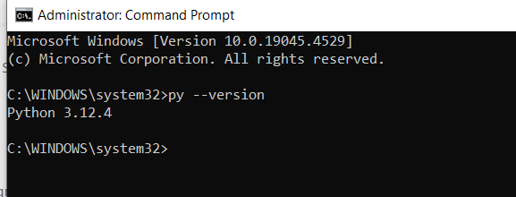

Set Up a Virtual Environment:
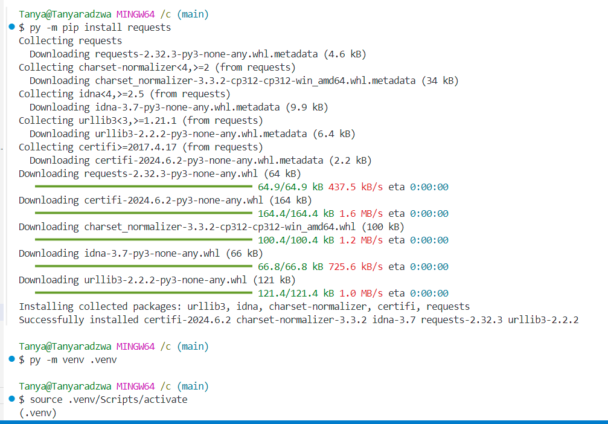

3. Python Syntax and Semantics:
   - Write a simple Python program that prints "Hello, World!" to the console. Explain the basic syntax elements used in the program.

   Explanation of Basic Syntax Elements
   
print() Function:
	Function: print() is a built-in function in Python that outputs messages to the console.
	Syntax: The print() function takes one or more arguments. In this case, it takes a single string argument "Hello, World!".
String:
	Definition: A string in Python is a sequence of characters enclosed within quotes.
	Syntax: Strings can be enclosed in either single quotes (') or double quotes ("). Here, "Hello, World!" is a string enclosed in double quotes.
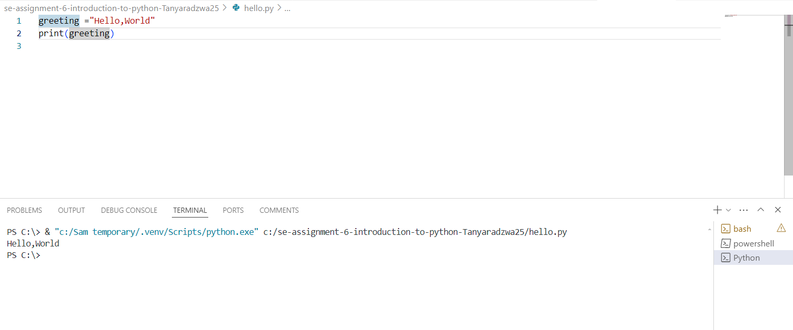

4. Data Types and Variables:
   - List and describe the basic data types in Python. Write a short script that demonstrates how to create and use variables of different data types.

Integers (int)
	Whole numbers, positive or negative, without decimals.
	Example: 42, -7
Floating-Point Numbers (float) 
Numbers that contain decimal points.Example: 3.14, -0.001
Strings (str)
	Sequence of characters enclosed in quotes.Example: "hello", 'world'
Booleans (bool)
	Logical values representing True or False.Example: True, False
Lists (list)
	Ordered, mutable collection of items, which can be of different types.Example: [1, 2, 3], ["apple", "banana", "cherry"]
Tuples (tuple)
	Ordered, immutable collection of items.Example: (1, 2, 3), ("apple", "banana", "cherry")
Dictionaries (dict)
	Unordered, mutable collection of key-value pairs.Example: {"name": "Alice", "age": 25}
Sets (set)
	Unordered collection of unique items.Example: {1, 2, 3}, {"apple", "banana", "cherry"}

	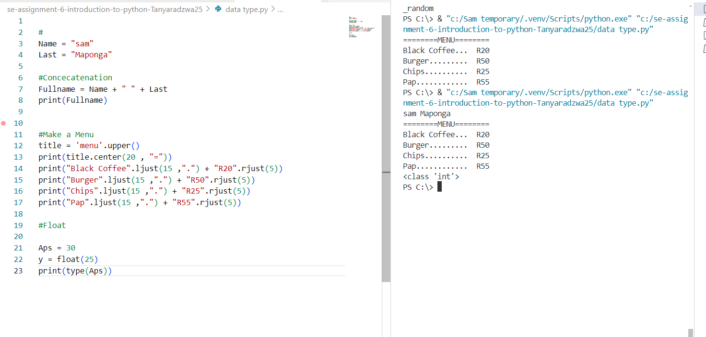

5. Control Structures:
   - Explain the use of conditional statements and loops in Python. Provide examples of an `if-else` statement and a `for` loop.

if condition:
     code block executed if condition is True
elif another_condition:
     code block executed if another_condition is True
else:
     code block executed if no above condition is True
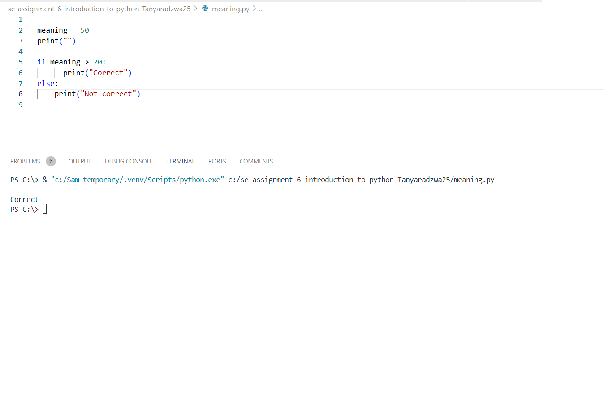

For Loop: A for loop is used to iterate over a sequence (such as a list, tuple, dictionary, set, or string) or other alterable objects.
for item in sequence:
     code block executed for each item in sequence
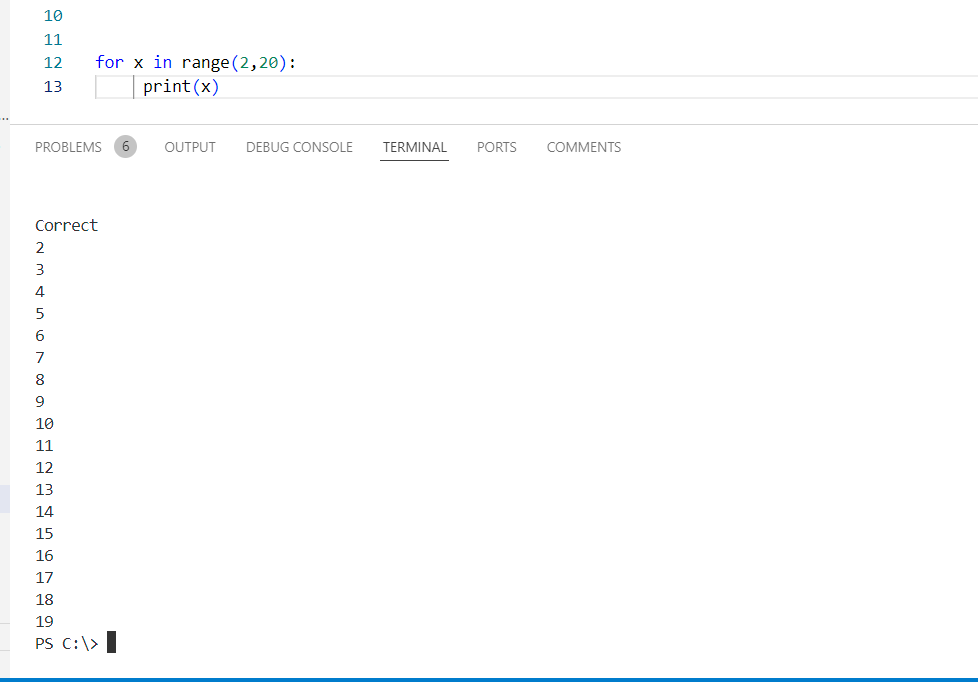

6. Functions in Python:
   - What are functions in Python, and why are they useful? Write a Python function that takes two arguments and returns their sum. Include an example of how to call this function.

Functions in Python are reusable blocks of code that perform a specific task. They are defined using the def keyword, followed by the function name, parentheses (which may include parameters), and a colon. The function body is indented and contains the statements that define what the function does. Functions can return a value using the return statement.

They are used for:

Code Reusability:
	Functions allow you to reuse code. Once a function is defined, it can be called multiple times from different parts of the program, reducing code duplication.
Modularity:
	Functions help in breaking down complex problems into smaller, manageable parts. Each function performs a specific task, making the code easier to understand and maintain.
Abstraction:
	Functions provide a way to encapsulate code and abstract away the implementation details. Users of the function only need to know how to call it and what it returns, not how it works internally.
Ease of Testing:
	Functions make it easier to test individual components of a program. You can test each function in isolation to ensure it works correctly.
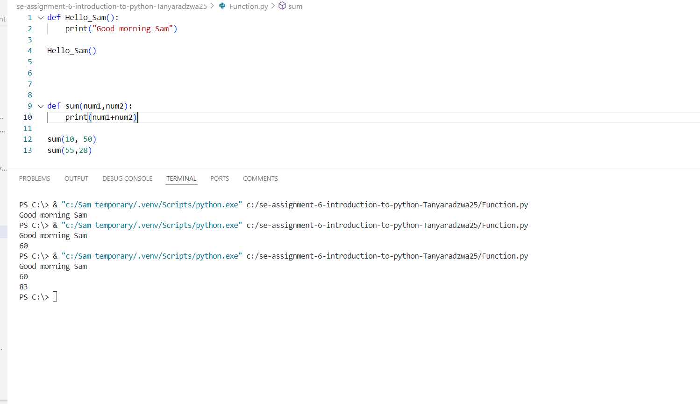

7. Lists and Dictionaries:
   - Describe the differences between lists and dictionaries in Python. Write a script that creates a list of numbers and a dictionary with some key-value pairs, then demonstrates basic operations on both.

Lists
Lists maintain the order of elements. The elements can be accessed by their position (index).
Elements in a list are accessed using zero-based indexing.
Lists can be modified after creation (elements can be added, removed, or changed).
Lists can store elements of the same type or different types (integers, strings, other lists, etc.).
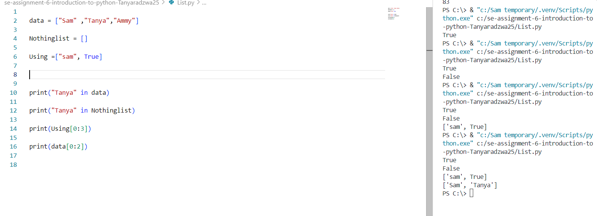

Dictionaries
Dictionaries do not maintain the order of elements. Python 3.7+ maintains insertion order as an implementation detail, but conceptually, dictionaries are unordered collections.
Dictionaries store data in key-value pairs. Each key is unique, and it maps to a value.
Dictionaries can be modified after creation (key-value pairs can be added, removed, or changed).
The keys must be immutable (strings, numbers, tuples), while the values can be of any type (including lists or other dictionaries).
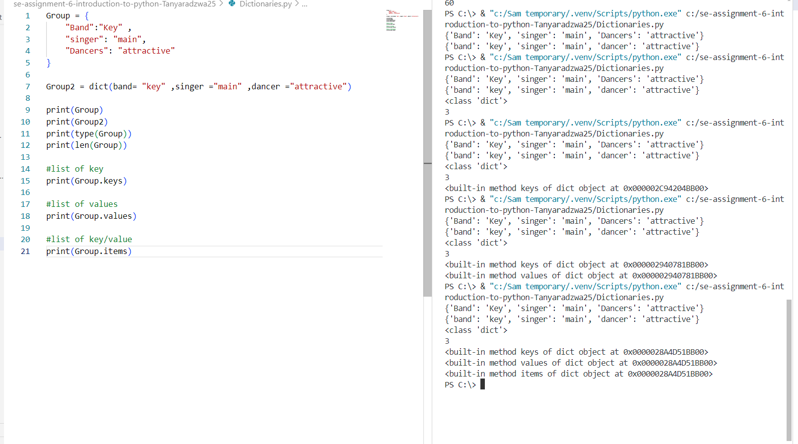

8. Exception Handling:
   - What is exception handling in Python? Provide an example of how to use `try`, `except`, and `finally` blocks to handle errors in a Python script.

Exception handling in Python allows us to gracefully manage and respond to errors that occur during program execution. It helps prevent abrupt termination of the program and provides the opportunity to handle errors in a controlled manner.

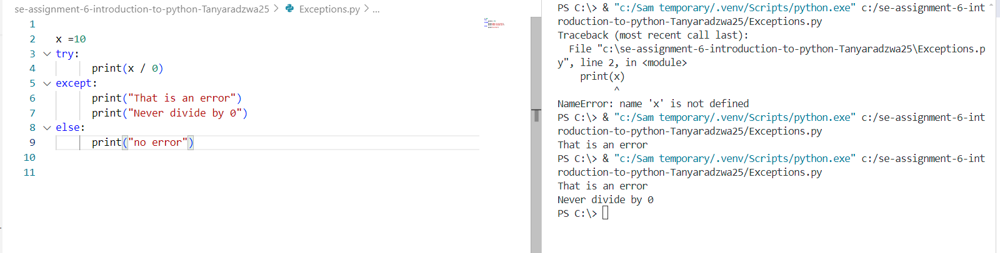
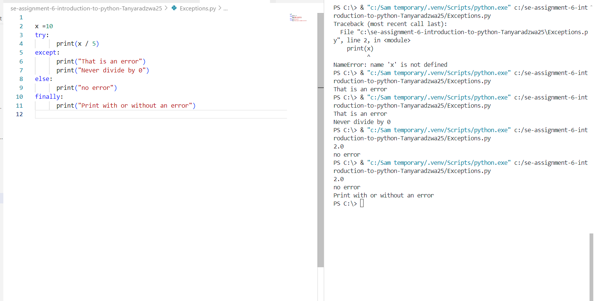

9. Modules and Packages:
   - Explain the concepts of modules and packages in Python. How can you import and use a module in your script? Provide an example using the `math` module.

Modules in Python are files containing Python code. They can define functions, classes, and variables that can be reused in other Python scripts. Modules help organize code into logical units and facilitate code reusability.

Packages are a way of structuring Python's module namespace by using "dotted module names". A package is a directory that contains multiple modules and a special file called __init__.py, which indicates that the directory should be treated as a package.

Importing and Using a Module:

To import a module in Python, you use the import statement followed by the name of the module. Once imported, you can use functions, classes, and variables defined in the module using dot notation (module_name.item_name).
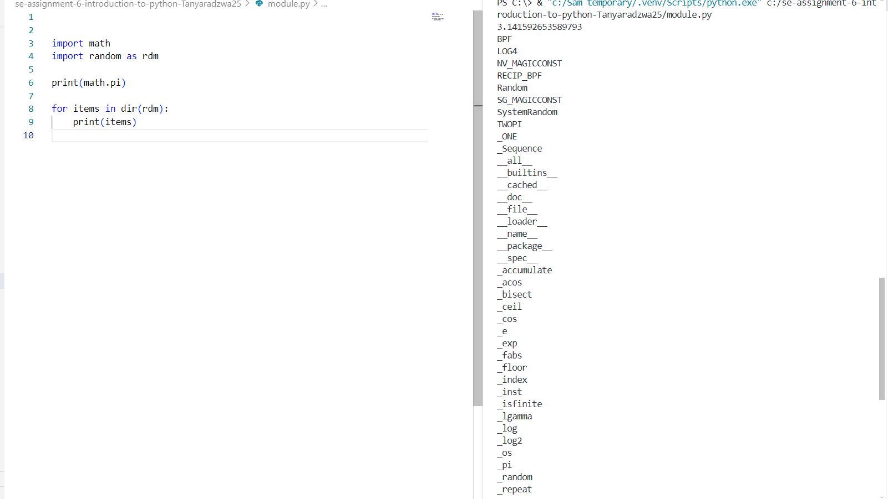

10. File I/O:
    - How do you read from and write to files in Python? Write a script that reads the content of a file and prints it to the console, and another script that writes a list of strings to a file.

	To read from a file in Python, you can use the open() function along with various modes like 'r' for reading, 'w' for writing, 'a' for appending, etc
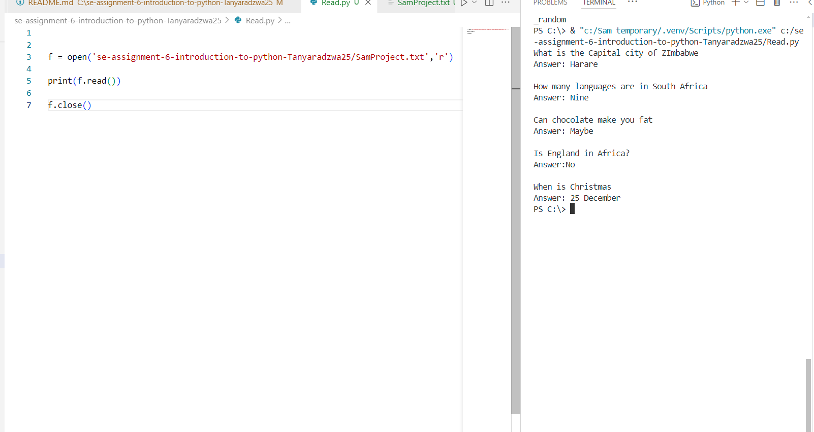

	To write to a file in Python, you again use the open() function, this time with 'w' mode for writing. If the file doesn't exist, it will be created. If it exists, its previous content will be overwritten.
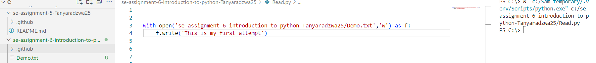

List of strings
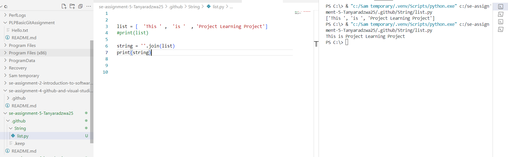
	

